# Energy Consumption Analysis Dashboard

A comprehensive Streamlit-based dashboard for analyzing energy consumption patterns using machine learning and statistical methods, with advanced anomaly detection capabilities.

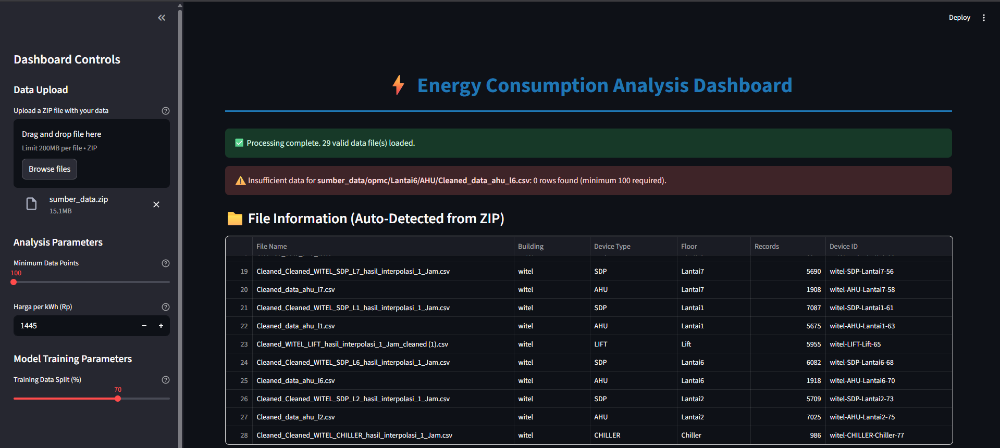
_Main dashboard interface showing the multi-tab analysis system_

## 🚀 Features

### Core Functionality

- **Multi-Level Analysis**: Analyze data at individual device, device type, floor, and building levels
- **Machine Learning Models**: Random Forest, Gradient Boosting, and LSTM neural networks
- **Advanced Anomaly Detection**: Statistical-based anomaly identification using trained models
- **Economic Feasibility Analysis**: Complete financial analysis with ROI, NPV, IRR calculations
- **Central Limit Theorem Analysis**: Statistical validation of data quality
- **Interactive Visualizations**: Dynamic charts and heatmaps for pattern exploration

### Technical Capabilities

- **Automated Feature Engineering**: Time-based features, lag variables, rolling averages
- **Multicollinearity Detection**: Automatic removal of highly correlated features
- **Time-Series Aware Splitting**: Chronological data splitting to prevent data leakage
- **Bulk Processing**: Train multiple models simultaneously
- **Data Export**: Download results as CSV files

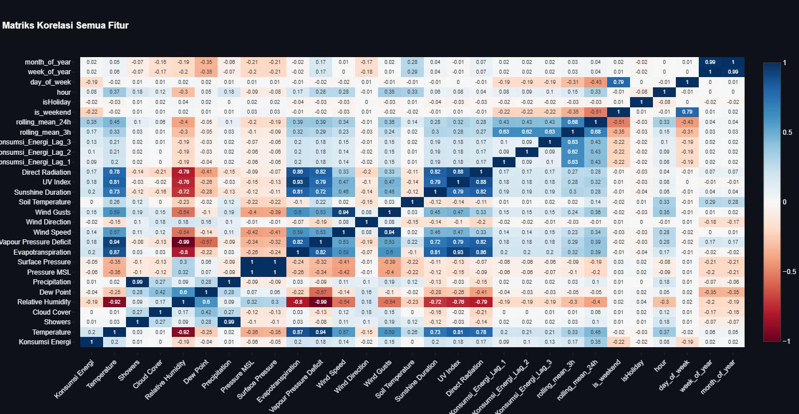

## 📊 Supported Device Types

| Device Type | Operating Hours | Description             |
| ----------- | --------------- | ----------------------- |
| AHU         | 08:00-16:00     | Air Handling Units      |
| SDP         | 00:00-23:00     | Sub Distribution Panels |
| LIFT        | 07:00-20:00     | Elevators               |
| CHILLER     | 08:00-17:00     | Cooling Systems         |

## 🛠 Installation

### Prerequisites

- Python 3.8+
- Required packages (see requirements.txt)

### Setup

```bash
# Clone the repository
git clone https://github.com/yourusername/energy-consumption-dashboard.git
cd energy-consumption-dashboard

# Create virtual environment
python -m venv venv
source venv/bin/activate  # On Windows: venv\Scripts\activate

# Install dependencies
pip install -r requirements.txt

# Run the dashboard
streamlit run app.py
```

### Requirements.txt

```
streamlit>=1.28.0
pandas>=2.0.0
numpy>=1.24.0
seaborn>=0.12.0
matplotlib>=3.7.0
scikit-learn>=1.3.0
tensorflow>=2.13.0
plotly>=5.15.0
holidays>=0.32
scipy>=1.11.0
joblib>=1.3.0
```

## 📁 Data Structure

### Required Folder Structure

Your ZIP file should follow this structure:

```
data.zip
├── building_name/
│   ├── floor_name/
│   │   ├── device_type/
│   │   │   └── data.csv
│   │   └── another_device/
│   │       └── data.csv
│   └── another_floor/
└── another_building/
```

Alternative structure:

```
data.zip
├── building_name/
│   ├── device_type/
│   │   └── data.csv
│   └── another_device/
└── another_building/
```

### Required CSV Format

Your CSV files must contain:

- `id_time`: Timestamp column (will be used as index)
- `Konsumsi Energi`: Energy consumption values in Wh
- Additional weather/environmental columns (optional but recommended)

## 🎯 Usage Guide

### 1. Data Upload

1. Prepare your data in the required folder structure
2. Create a ZIP file containing all your data
3. Upload via the sidebar file uploader
4. Adjust minimum data points threshold if needed

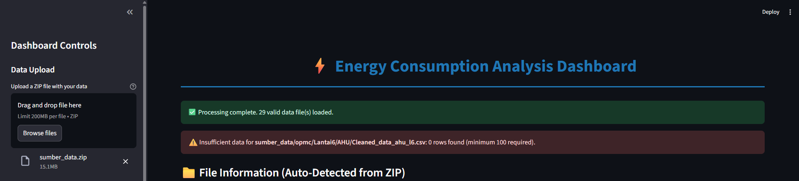

### 2. Data Overview

Navigate through the tabs to explore your data:

- **Data Overview**: Summary statistics and time series visualization
- **Building Analysis**: Building-level consumption patterns
- **Device Analysis**: Device type comparison and patterns
- **Floor Analysis**: Floor-level energy distribution

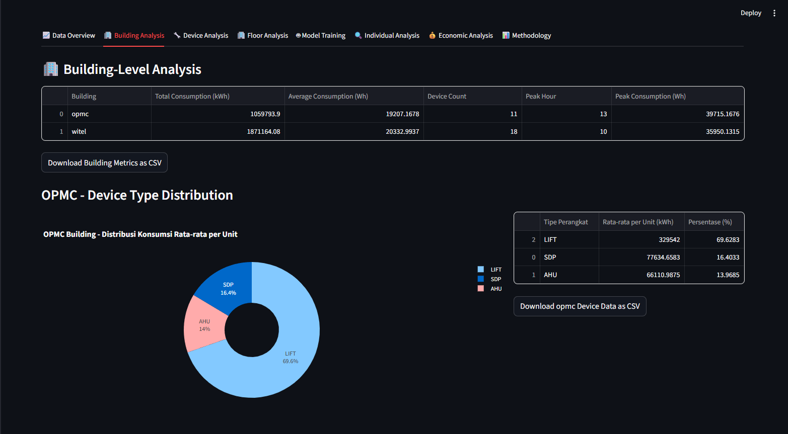
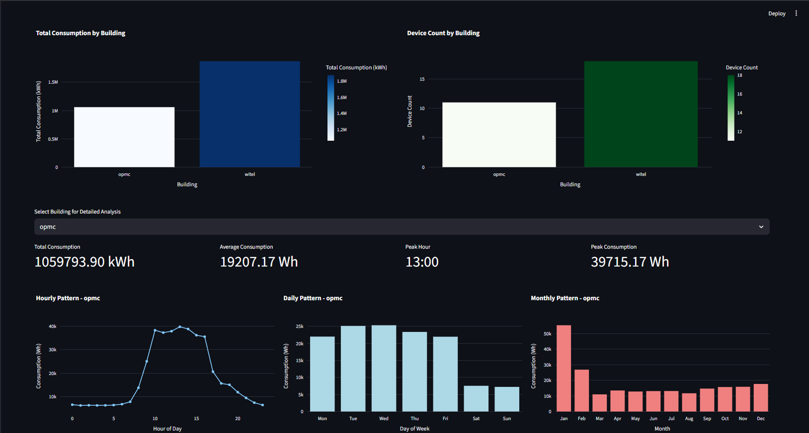
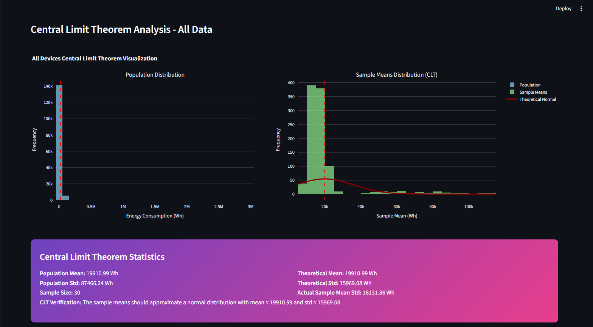
_Data overview tab showing consumption patterns and Central Limit Theorem analysis_

### 3. Model Training

Choose between two training modes:

#### Individual Device Training

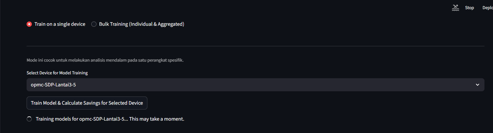

- Select specific devices for detailed analysis
- Get comprehensive model performance metrics
- View feature importance and predictions

#### Bulk Training

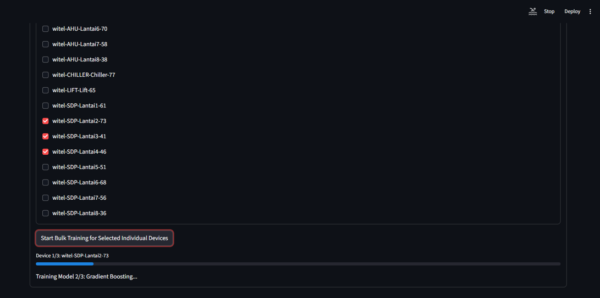
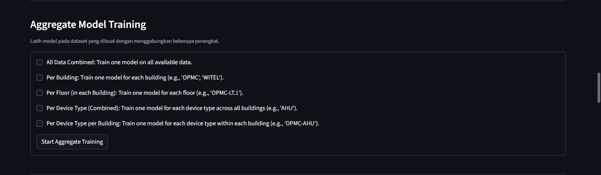

- Train multiple models simultaneously
- Generate training summary with performance heatmaps
- Support for aggregated datasets (buildings, device types, floors)

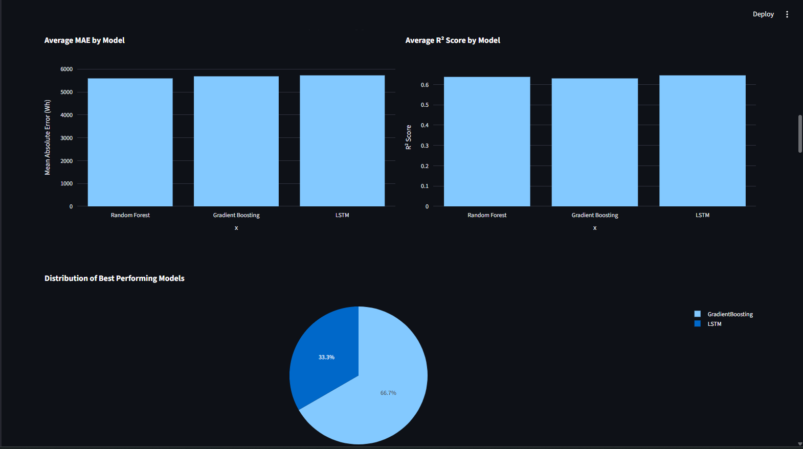
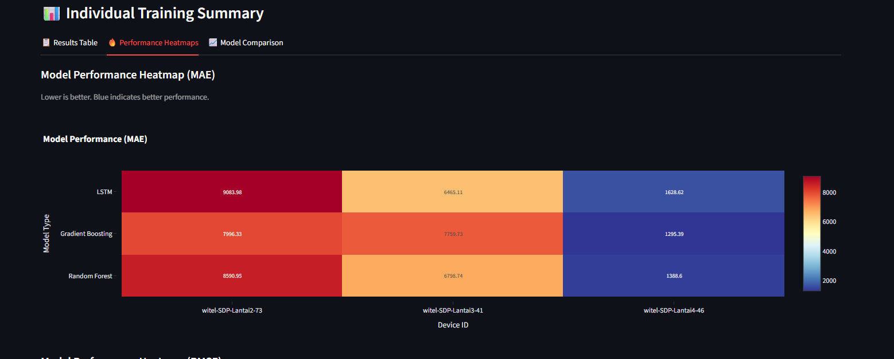
_Model training interface showing performance comparison and heatmaps_

### 4. Anomaly Detection

The system automatically detects anomalies using statistical methods:

- Uses the best-performing ML model to predict normal consumption
- Applies 2-sigma threshold for anomaly identification
- Calculates potential energy savings
- Provides detailed anomaly patterns by hour and day

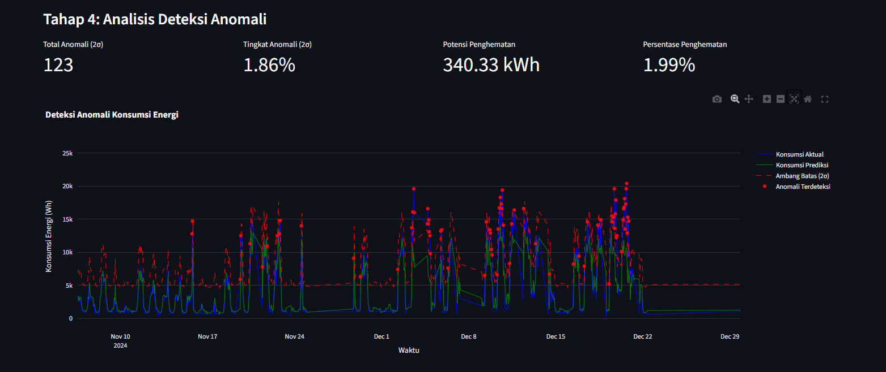
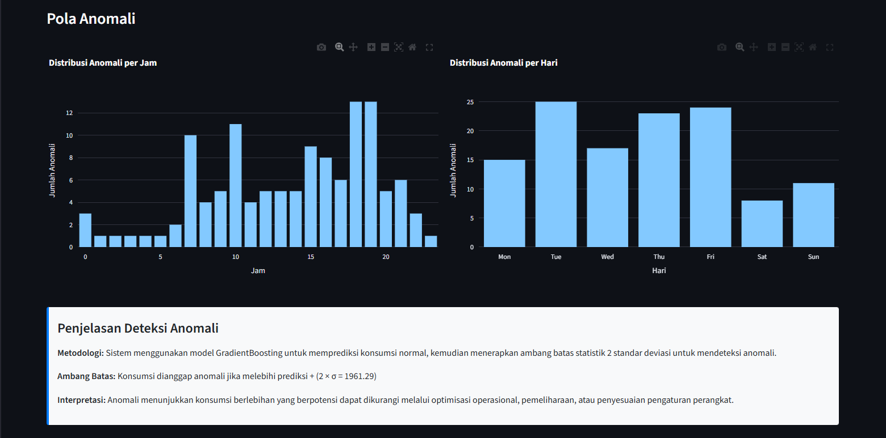
_Anomaly detection visualization showing identified outliers and savings potential_

### 5. Economic Analysis

Two calculation methods available:

#### Model-Based Analysis

- Uses anomaly detection results to estimate savings
- Automatically calculates annual projections
- Comprehensive financial metrics

#### Manual Calculator

- Input custom project parameters
- Evaluate any energy efficiency initiative
- Compare different scenarios

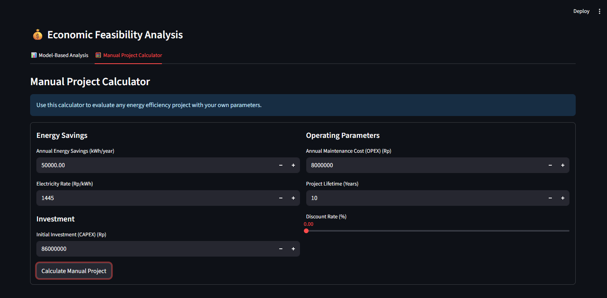
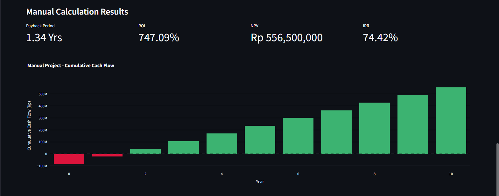
_Economic analysis showing cash flow projections and financial metrics_

## 📊 Key Metrics Explained

### Model Performance Metrics

- **MAE (Mean Absolute Error)**: Average prediction error in Wh
- **RMSE (Root Mean Square Error)**: Penalizes larger errors more heavily
- **R² Score**: Proportion of variance explained by the model (0-1, higher is better)

### Economic Metrics

- **Payback Period**: Time to recover initial investment
- **ROI**: Return on Investment over project lifetime
- **NPV**: Net Present Value considering discount rate
- **IRR**: Internal Rate of Return

### Anomaly Detection

- **Statistical Threshold**: Predicted consumption + (2 × standard deviation)
- **Anomaly Rate**: Percentage of data points identified as anomalous
- **Savings Potential**: Sum of excess consumption above threshold


_Anomaly detection visualization showing identified outliers and savings potential_

## 🧠 Machine Learning Pipeline

### Feature Engineering

1. **Lag Features**: Previous 1-3 hours of consumption
2. **Rolling Averages**: 3-hour and 24-hour moving averages
3. **Time Features**: Hour, day of week, month, holidays
4. **Weather Integration**: Temperature, humidity, and other environmental factors

### Model Selection

The system trains three models and automatically selects the best performer:

- **Random Forest**: Ensemble method, robust to outliers
- **Gradient Boosting**: Sequential ensemble, captures complex patterns
- **LSTM**: Neural network, specialized for time series

### Validation Strategy

- Time-series aware train/validation/test split
- Chronological splitting to prevent data leakage
- Cross-validation on temporal data

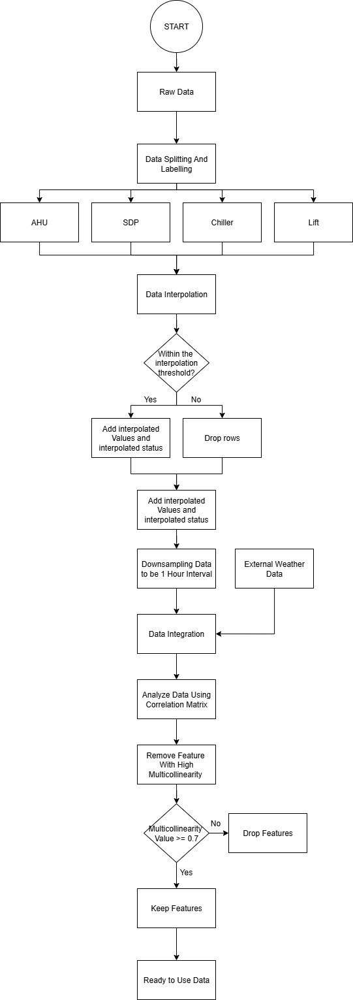
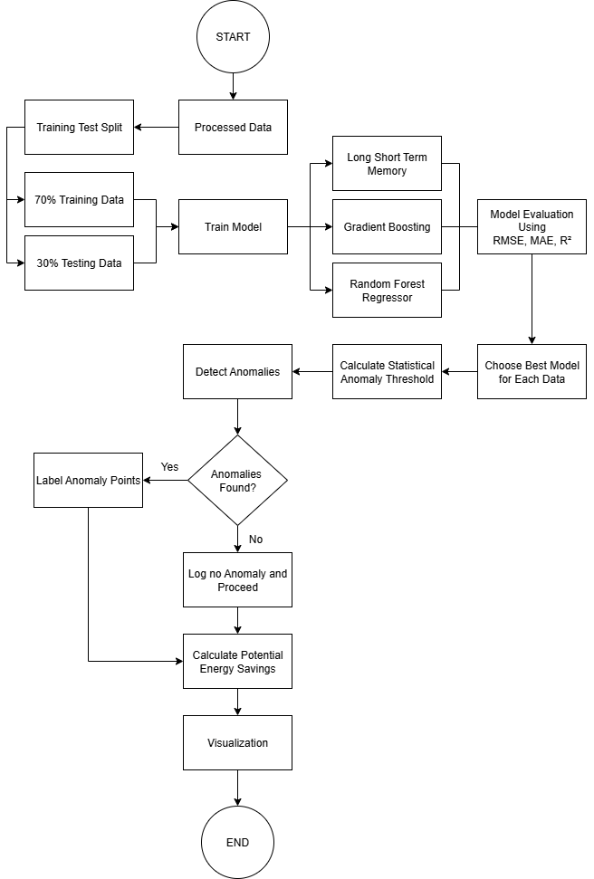
<br/>_Machine learning pipeline flowchart showing data processing and model training_

## 🔬 Statistical Analysis

### Central Limit Theorem Validation

The dashboard includes CLT analysis to validate data quality:

- Population distribution visualization
- Sample means distribution (n=30)
- Theoretical vs. actual normal distribution comparison

This helps verify that your data is suitable for statistical analysis and that the machine learning models can make reliable predictions.

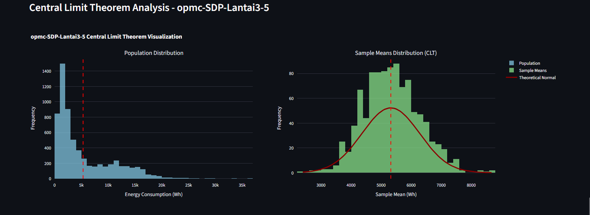
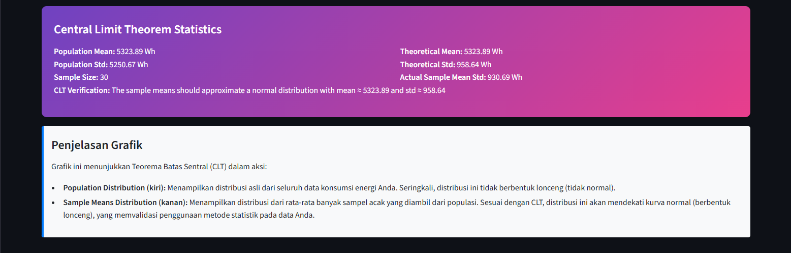
_Central Limit Theorem visualization showing population and sample distributions_

## 📈 Visualization Features

### Interactive Charts

- **Time Series Plots**: Consumption patterns over time
- **Correlation Heatmaps**: Feature relationship analysis
- **Performance Heatmaps**: Model comparison across devices
- **Anomaly Visualization**: Highlighted outliers and thresholds
- **Cash Flow Charts**: Economic analysis visualization

### Export Capabilities

- Download any dataframe as CSV
- Export model training summaries
- Save economic analysis results
- Generate comprehensive reports

## ⚡ Performance Considerations

### Data Requirements

- Minimum 100-2000 data points per device (configurable)
- Hourly or sub-hourly timestamps recommended
- At least 30 days of data for reliable patterns

### Processing Time

- Individual device: ~30-60 seconds
- Bulk training: ~2-5 minutes for 10 devices
- Aggregated models: ~1-3 minutes depending on data size

### Memory Usage

- Optimized for datasets up to 100MB ZIP files
- Efficient pandas operations
- Streamlit caching for improved performance

## 🛡 Data Privacy & Security

- All processing happens locally in your browser
- No data is sent to external servers
- Session-based storage only
- No permanent data retention

## 🐛 Troubleshooting

### Common Issues

#### "Insufficient data" error

- Ensure CSV files have enough rows (check minimum threshold)
- Verify the `Konsumsi Energi` column exists and has non-zero values

#### ZIP file not recognized

- Check folder structure matches requirements
- Ensure building names are 'opmc' or 'witel'
- Verify CSV files are properly formatted

#### Model training fails

- Check for missing values in key columns
- Ensure adequate data quality and quantity
- Try reducing the minimum rows threshold

#### Performance issues

- Reduce the number of devices in bulk training
- Check available system memory
- Close other browser tabs

### Support

For technical issues or questions:

1. Check the methodology section in the dashboard
2. Review this README thoroughly
3. Create an issue on GitHub with:
   - Error message (if any)
   - Data structure description
   - Steps to reproduce

## 📚 Technical Documentation

### Code Structure

```
├── app.py                 # Main Streamlit application
├── requirements.txt       # Python dependencies
├── README.md             # This file
└── data/                 # Example data (if provided)
```

### Key Functions

- `load_and_process_data()`: Data loading and preprocessing
- `train_models()`: Machine learning model training
- `detect_anomalies_detailed()`: Statistical anomaly detection
- `calculate_economic_metrics()`: Financial analysis
- `visualize_clt()`: Central Limit Theorem analysis

## 🤝 Contributing

Contributions are welcome! Please:

1. Fork the repository
2. Create a feature branch
3. Make your changes
4. Add tests if applicable
5. Submit a pull request

### Development Setup

```bash
# Install development dependencies
pip install -r requirements-dev.txt

# Run tests
python -m pytest tests/

# Code formatting
black app.py
flake8 app.py
```

## 📄 License

This project is licensed under the MIT License - see the LICENSE file for details.

## 🙏 Acknowledgments

- Built with [Streamlit](https://streamlit.io/)
- Machine learning powered by [scikit-learn](https://scikit-learn.org/) and [TensorFlow](https://tensorflow.org/)
- Visualizations created with [Plotly](https://plotly.com/)
- Statistical analysis using [SciPy](https://scipy.org/)

## 📞 Contact

For questions, suggestions, or collaboration opportunities:

- GitHub Issues: [Create an issue](https://github.com/yourusername/energy-consumption-dashboard/issues)
- Email: your.email@domain.com
- LinkedIn: [Your LinkedIn Profile](https://linkedin.com/in/yourprofile)

---

**Made with ❤️ for energy efficiency and sustainability**
